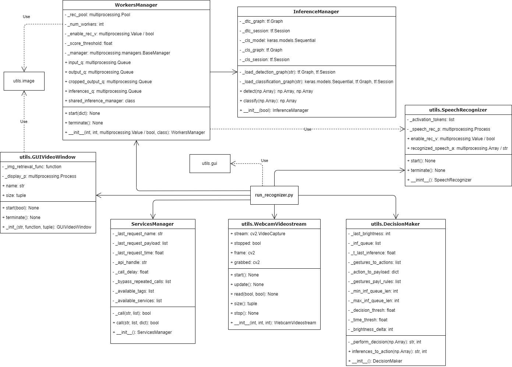

# HandReco, a gesture-based controller for IoT

## Brief description
Demo project to test hand detection and gesture classification to control IoT devices over the network.

Developed in Python with Tensorflow, Keras, OpenCV.

## Architecture overview


| Component             | Description |
| :-------------------- | :---------- |
| **run_recognizer.py** | This script serves as the Controller, as it manages the GUI and the components that provide various functionalities. It is the startup script that takes input parameters (which can be passed through the command line as arguments) to customize certain functionalities. |
| **WebcamVideostream** | Provides OpenCV access to the webcam, giving access to video frames. It operates on a dedicated Thread. |
| **GUIVideoWindow**    | Manages a GUI window through a dedicated Process to show the user image frames from a video source. It obtains those frames from an input function given to it during initialization. |
| **WorkersManager**    | Manages a Pool of processes and four Queues that process frames obtained from the video source, detect the presence of hands, and classify gestures through a class (which, in the current architecture, is InferenceManager) passed to it during initialization. |
| **InferenceManager**  | It loads and manages inference models for hand detection and hand-gesture classification through two separate models. |
| **DecisionMaker**.    | Given a sequence of inferences collected within a specific time frame, it decides whether and which service to call and which parameters to include in the HTTP call. |
| **ServicesManager**   | Manages calls to IoT services provided by the hotspot. |
| **SpeechRecognizer**  | It handles speech-to-text functionality, continuously listening to the user to recognize their speech. |

## Add new gestures
The scripts described in this section are to be executed while maintaining the main project folder as the current path.

| Script                  | Description |
|:------------------------|:------------|
| **add_gesture.py**      | Allows you to add data to existing classes, create new classes, and add data to the Garbage class, considered the gesture with the hand at rest and for which no action should be taken. After selecting the operation to be performed, the script records the video from the webcam and then performs hand detection frame by frame, saving the recognized POI in a JPEG file. |
| **train_classifier.py** | In addition to receiving various arguments for customizing the parameters used for model training, it performs dataset normalization by permanently reducing all images to the size of 28x28 (default value, but customizable) and then starts the training phase. Finally, it saves the model for later reuse in the main script. |

## Configuration details
These parameters should be put in a *config.ini* file.

|                         | Type    | Description                                               | Example                             |
| :---------------------- | :------ | :-------------------------------------------------------- | :---------------------------------- |
| **[MODELS]**              |         |                                                           |                                     |
| DetectionPath           | *str*   | Path to the detection model                               | ```./frozen\_inference\_graph.pb``` |
| DetectionScoreThreshold | *float* | Threshold for accepting hand detection score              | ```0.18```                          |
| ClassificationPath      | *str*   | Path to the classification model                          | ```./numbers\_wGarbage\_5.h5```     |
| **[SPEECH]**              |         |                                                           |                                     |
| ActivationTokens        | *CSV*   | Tokens for activating/deactivating detection and classification for IoT control | ```ok hotspot,hey hotspot``` |
| **[SERVICES]**            |         |                                                           |                                     |
| ApiHandle               | *str*   | Path for HTTP calls to the API (ends without /)           | ```http://localhost/api/services``` |
| CallWaitInterval        | *float* | Time interval between API calls                           | ```2.5```                           |
| ServicesBypassRepetedCalls | *CSV* | Actions that can be performed repeatedly, even with the same Payload | ```toggle```            |
| AvailableTags           | *CSV*   | Device tags that are allowed to receive actions           | ```ai_room```                       |
| **[DECISIONS]**           |         |                                                           |                                     |
| GesturesToActions       | *CSV*   | Mapping between Gesture and IoT service (gestures considered in alphabetical order, also \'\' means no action) | ```turn_on,,toggle,``` ```turn_on,turn_on``` |
| ActionAssociatedPayload | *JSON dict* | Mapping between actions and accepted parameters | ```{"turn_on":"brightness",``` ```"toggle":"brightness"}``` |
| GesturesPayloadRules    | *CSV*   | *Int (0-255)*, set specified value; *s = same*, retains previous value; *d = decrease*, decrement by *BrightnessDelta*; *i = increase*, increment by *BrightnessDelta* | ```255,,s,i,d``` |
| MinInferenceQueueLength | *int*   | Minimum number of accumulated inferences to make a decision on which action to perform | ```12``` |
| MaxInferenceQueueLength | *int*   | Maximum number of accumulated inferences to make a decision on which action to perform. Once the queue is exceeded, it is emptied. | ```36``` |
| DecisionThreshold       | *float* | Percentage threshold of inferences of the same type in the queue for a decision to be made | ```60``` |
| EmptyQueueTimeThreshold | *float* | Time after which to empty the inference queue if no new inferences are added | ```2```          |
| BrightnessDelta         | *int*   | Value by which the intensity of the light is increased/decreased | ```10```                     |
